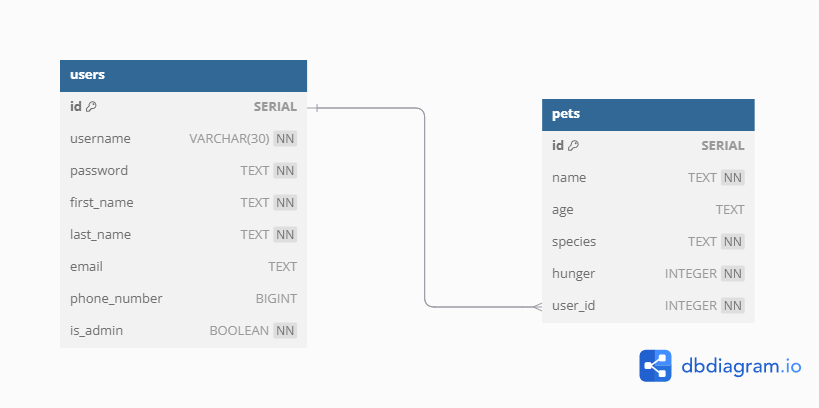

# Pet Health Tracker

## Description

The Pet Health Tracker is a web application that helps pet owners keep track of their pets' health records, vaccinations, medical history, and vet appointments. This centralized platform ensures that pet owners never miss an important check-up and have easy access to all essential pet health information.

## Deployment

Live Demo https://capstone-project-two-aqdd.onrender.com

## Technologies Used

- Frontend: React, React Router, CSS

- Backend: Node.js, Express.js

- Database: PostgreSQL

- Authentication: JWT-based authentication

- Hosting: Render.com

## Entity Relationship Diagram (ERD)



## Installation Instructions

### Prerequisites

- Node.js installed on your machine

- PostgreSQL database setup

### Steps to Install Locally

##### Clone the repository:
```sh
git clone https://github.com/hatchways-community/capstone-project-two-3a7637df94fb49348af04278bca20253.git
cd capstone-project-two-3a7637df94fb49348af04278bca20253
```
##### Install dependencies:
```sh
npm --prefix ./backend install ./backend
npm --prefix ./frontend install ./frontend
```

##### Run database migrations:
```sh
cd backend
psql < capstone.sql
```
##### Start the backend server:
```sh
npm start
```
##### Start the frontend:
```sh
npm run dev
```
## Usage

- Sign up and create a user account.

- Add pets to your profile, including name, age, species, and breed.

- Log vaccinations and medical records.

- Set reminders for upcoming vet appointments.

- Upload documents related to pet health.

## Features

- User authentication and profile management

- CRUD operations for pet profiles

- Medical history and vaccination tracking

- Reminder notifications for vet appointments

- Secure data storage with JWT authentication

## Contributing

We welcome contributions! To contribute:

- Fork the repository

- Create a new branch (git checkout -b feature-name)

- Commit your changes (git commit -m 'Add new feature')

- Push to the branch (git push origin feature-name)

- Open a pull request

## Contact

For questions or suggestions, reach out:

- Email: malmonte827@gmail.com
